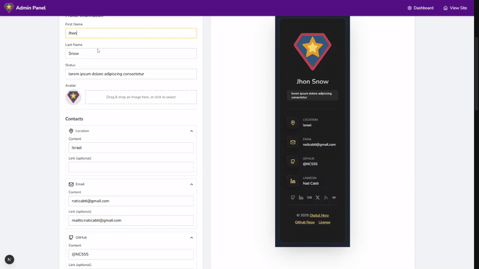

# Nati Portfolio 🌟

> A developer-friendly portfolio website with visual editing capabilities powered by TinaCMS

A modern, responsive portfolio website built with cutting-edge web technologies that makes content management effortless through an intuitive visual editor.

[](https://nc555.vercel.app/) [](https://github.com/NC555/NC555/stargazers) [](https://claude.ai/chat/LICENSE)

## ✨ Features

- 🎨 Modern and sleek design
- 📱 Fully responsive across all devices
- 🚀 Optimized performance
- 📝 Blog functionality
- 🖼️ Portfolio showcase
- 📊 Interactive components
- 🔧 TinaCMS for easy content management
- 🔍 SEO-friendly structure
- 🌓 Dark/Light mode support
- 🔄 Real-time content preview

## 🛠️ Technologies


## 📸 Screenshots

<div style="display:flex; flex-wrap:wrap; justify-content:center">      
</div>

## 🚀 Getting Started

### Prerequisites

- Node.js 20.19.1 or later
- pnpm (recommended)

### Installation

1. Clone the repository

   ```bash
   git clone https://github.com/YOUR_USERNAME/noy-portfolio.git
   cd noy-portfolio
   ```

2. Install dependencies

   ```bash
   pnpm install
   ```

3. Create a `.env` file based on `.env.example`

4. Start the development server

   ```bash
   pnpm run dev
   ```

   > **Note:** The `dev` script uses the `--turbo` flag to enable Next.js Turbopack for potentially faster development performance. It also sets a Node.js memory limit (`--max-old-space-size=8192`). You can adjust this memory value (e.g., `4096` for 4GB) in the `package.json` file based on your system's resources if needed.

5. Open [http://localhost:3000](http://localhost:3000) in your browser

6. Access the admin panel at [http://localhost:3000/admin](http://localhost:3000/admin) to manage content

## 🔧 Configuration

You can customize the portfolio by editing the configuration files in the `src/data` directory or by using the admin interface.

### Admin Interface: Editable Configuration Files

| File                          | Description                    | Admin Page                                                          |
| ----------------------------- | ------------------------------ | ------------------------------------------------------------------- |
| `src/data/homeConfig.json`    | Home page content and settings | [/admin/home-editor](http://localhost:3000/admin/home-editor)       |
| `src/data/sidebarConfig.json` | Sidebar information and links  | [/admin/sidebar-editor](http://localhost:3000/admin/sidebar-editor) |
| `src/data/resumeConfig.json`  | Resume/CV page content         | [/admin/resume-editor](http://localhost:3000/admin/resume-editor)   |
| `src/data/blogConfig.json`    | Blog settings                  | [/admin/blog](http://localhost:3000/admin/blog)                     |
| `src/data/galleryConfig.json` | Gallery settings               | [/admin/gallery-editor](http://localhost:3000/admin/gallery-editor) |
| `src/data/appConfig.json`     | Global application settings    | -                                                                   |

###

For better compatibility and ease of use, it's recommended to edit content through the admin interface:

- **Main Admin Panel**: [/admin](http://localhost:3000/admin)
- **Home Page Editor**: [/admin/home-editor](http://localhost:3000/admin/home-editor)
- **Sidebar Editor**: [/admin/sidebar-editor](http://localhost:3000/admin/sidebar-editor)
- **Resume Editor**: [/admin/resume-editor](http://localhost:3000/admin/resume-editor)
- **Blog Management**: [/admin/blog](http://localhost:3000/admin/blog)
- **Portfolio Management**: [/admin/portfolio](http://localhost:3000/admin/portfolio)
- **Gallery Editor**: [/admin/gallery-editor](http://localhost:3000/admin/gallery-editor)

## 🔄 Deployment

This template works seamlessly with Vercel, Netlify, and other Next.js-compatible hosting platforms.

### One-Click Deploy

[](https://vercel.com/new/clone?repository-url=https%3A%2F%2Fgithub.com%2FNC555%2FNC555) [](https://app.netlify.com/start/deploy?repository=https://github.com/NC555/NC555)

## 🏆 Performance Metrics

| Metric         | Score   |
| -------------- | ------- |
| Performance    | 98/100  |
| Accessibility  | 100/100 |
| Best Practices | 95/100  |
| SEO            | 100/100 |

## 📝 License

This project is licensed under the MIT License - see the LICENSE file for details.

## 👨‍💻 Author

Created with ❤️ by Nati Cabti

[](https://www.linkedin.com/in/nati-cabti/)

---

If you're using this template, I'd love to see your portfolio! Please share it with me.

⭐ Star this repo if you find it useful!
